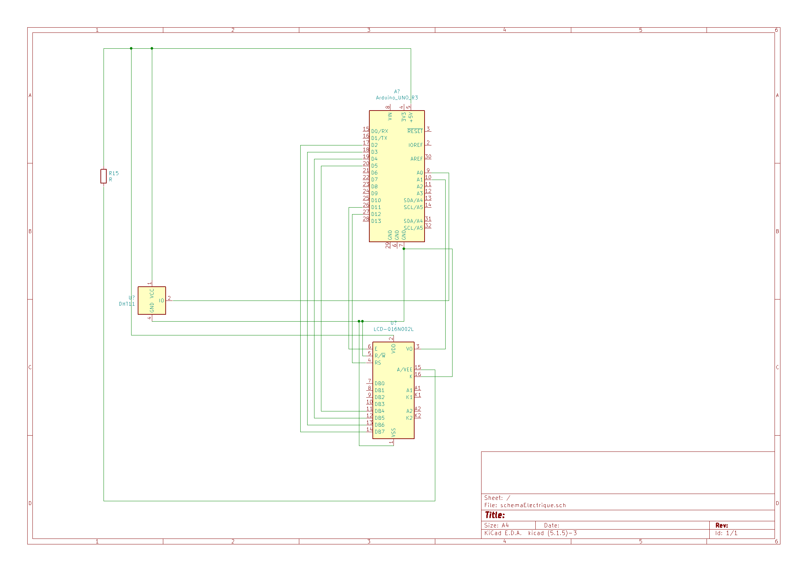

# Moniteur de la temperature a long terme avec base de donnes
## Laurentiu Tanase - 1241F

## 1. Introduction

L'idée de cette thèse était de construire un dispositif embarqué basé sur Arduino pour surveiller les variables environnementales: humidité et température et étudier ses performances à différentes températures et humidité.

La surveillance des variables environnementales telles que la température, la pression et l'humidité a une longue histoire de développement et les variables ont montré un impact significatif sur la productivité de la croissance des plantes, la qualité de l'industrie alimentaire et l'efficacité de nombreux équipements sensibles à la température et à l'humidité. La surveillance de la température et de l'humidité des laboratoires, des entrepôts, des halls, des écoles et des hôpitaux est importante en ce qui concerne la santé et l'hygiène. La mesure et la surveillance fiables sont cruciales dans cette ère concurrentielle de la technologie.

Ce projet comprend deux parties - une partie théorique qui donne une introduction de base aux matériaux et équipements utilisés pendant le projet et la deuxième partie fournit un processus par étapes pour la connexion et les circuits. Le projet a réussi à atteindre des objectifs prédéterminés, la mise en œuvre a été possible à l'aide du livre Arduino, des travaux antérieurs d'un autre étudiant et des sites Internet connexes où la plupart des informations sont disponibles.

Les capteurs utilisés dans ce travail sont le capteur de température et d'humidité-DHT11. Le sensor DHT11 est un capteur analogique conçu pour détecter le changement physique de la chaleur et de l'humidité lorsqu'il est exposé dans l'air avec un câblage et une programmation appropriés.

## 2. Les exigences fonctionnelles pour le projet proposé

Pour enregistreur de température a long terme, on propose de concevoir un système embarqué avec les fonctionnalités suivantes:
* Mesurer la temperature a toutes les trente minutes;
* Publier les temperatures merusees dans une base de données, pour permettre l’analyse des donnees passes;
* Afficher toutes les valeurs mesurees, actuelles et precedents, sur un ecran, en utilisant du texte et des graphiques;
* Alerte sonore lorsque la temepérature dépassent des valeurs configurables par l’utilisateur

## 3. Les exigences techniques

### 3.1 Analyse des autres projets d'enregistrement de température sur le long terme

La température est la principale caractéristique de l'environnement, c'est pourquoi elle est l'une des grandeurs physiques les plus enregistrées. En ce sens, nous trouvons de nombreux projets qui enregistrent la température, des centres météorologiques aux projets individuels, réalisés à des fins éducatives ou pour analyser les données fournies.
À cet égard, nous avons analysé un projet réalisé comme thèse par Nagendra Dangi, étudiante à la Metropolitan University of Applied Sciences à Helsinki.
https://www.theseus.fi/bitstream/handle/10024/142235/Dangi_Nagendra.pdf?sequ
Il existe également de nombreuses entreprises dans le monde qui enregistrent les températures locales et les analysent pour pouvoir prévoir les différents phénomènes météorologiques. Un tel exemple est https://wunderground.com, qui affiche non seulement la température actuelle et offre la possibilité de visualiser les températures passées, ainsi qu'une prévision des événements météorologiques qui se produiront dans un avenir proche ou lointain.

### 3.2 Analyse des moniteurs de temperature a long terme disponibles dans le commerce

Le premier recherche sur le google pour "environment temperature monitor system long term" trouve le site du Vaisala. Les origines de Vaisala remontent aux années 1930 lorsque le professeur Vilho Väisälä, fondateur et directeur général de longue date de Vaisala, a inventé certains des principes de fonctionnement d'une radiosonde. L'entreprise a été créée en 1936 en Finlande et les premières radiosondes ont été fabriquées au sous-sol d'un immeuble résidentiel au centre d'Helsinki. Après un début modeste, l'entreprise a évolué pour devenir un leader mondial dans de nombreux domaines de mesure. Vaisala est un leader mondial de la mesure environnementale et industrielle. S'appuyant sur plus de 80 ans d'expérience, Vaisala fournit des observations pour un monde meilleur. Nous sommes un partenaire fiable pour les clients du monde entier, offrant une gamme complète de produits et services innovants d'observation et de mesure. Même si le systemes de Vaisala sont plus cher, avec des prix variee entre 300 a 3000 Euro, des produits sont tres qualitatifs.

### 3.3 Analyse des services de base de données appropriés pour ce projet

Compte tenu de l'utilisation des bases de données dans la vie moderne, lorsque toutes les informations se trouvent à un clic de distance de l'utilisateur et de la croissance des services REST, les options de base de données que j'ai trouvées sont les suivantes:

* FirebaseDB
* RestDB

FirebaseDB est une application qui stockez et synchronisez des données avec notre base de données cloud NoSQL. Les données sont synchronisées en temps réel sur tous les clients et restent disponibles lorsque votre application se déconnecte.
La base de données en temps réel Firebase est une base de données hébergée dans le cloud. Les données sont stockées sous forme de JSON et synchronisées en temps réel sur chaque client connecté. Lorsque vous créez des applications multiplates-formes avec nos kits de développement logiciel (SDK) iOS, Android et JavaScript, tous vos clients partagent une instance de base de données en temps réel et reçoivent automatiquement les mises à jour avec les données les plus récentes.
Pour l'utilisation de l'API, vous pouvez utiliser n'importe quelle URL de base de données Firebase en tant que point de terminaison REST. Il suffit d’ajouter .json à la fin de l’URL et d’envoyer une requête à partir de votre client HTTPS préféré.

RestDB est un service cloud de base de données NoSQL. Les données sont accessibles en tant qu'objets JSON via HTTPS. Cela donne une grande flexibilité, une intégration système facile et une compatibilité future.
Un schéma avec Collections (tables), champs et relations est créé directement dans votre navigateur Web. restdb.io crée dynamiquement une API REST et une API Javascript pour refléter votre schéma.
L'accès aux données est sécurisé avec des clés API ou par authentification d'utilisateur externe à l'aide du service Auth0. Vous pouvez facilement interroger la base de données avec un paramètre d'URL contenant une requête de type MongoDB.
Une API temps réel pour l'écoute d'événements REST (POST, PUT, DELETE) ou d'événements personnalisés ouvre de nombreuses possibilités.
Pour créer des intégrations flexibles, chaque collection peut également disposer de Webhooks ou de codeshooks (Javascript côté serveur).

### 3.4 Les spécifications détaillées du système proposé
Sur la base de l’analyse ci-dessus, et considerant que ce projet a avant tout une valeur éducative, nous pouvons rediger les spécifications détaillées de notre système comme suit:

* L'utilisation d'un capteur de la temperature d'air.
* Nous aimerions afficher les ecrans d’information suivants, commutable par l’utilisateur:
  * Vue de temperature acctuel dans un ecran
  * Donnees historiques pour temperature (par jour / mois)
* Il n’y a pas des contraintes de temps reel; un point de données toutes les 30 minutes, par exemple, devrait étre suffisant, et cela ne va pas atteindre les limites de niveau gratuit du systéme de gestion des données.
* Nous avons besoin d’une plate-forme de developpement intégrée avec une interface Internet, et le Wi-Fi est probablement le choix le plus logique, comme il est largement utilisé a l’intérieur. Si nous devions concevoir un moniteur d’exterieur, nous ne pouvions plus compter sur la disponibilité du WiFi; dans ce cas, une interface GSM ou LORA aurait eté un meilleur choix.
* Il n’y a pas des exigences concernant la puissance de calcul; une carte Arduino avec microcontroleur AT-MEGA328p ou ATMEGA32 ou similaire devrait etre suffisant, tant qu’il dispose d’un module Wi-Fi (externe ou integrée).
* Comme eléments d’interface utilisateur, nous avons besoin d’un écran (il peut étre un ecran LCD), pour afficher le temperature acctuelle.
* Nous n’avons pas besoin que l’appareil resiste aux conditions extrémes, mais un boitier simple est nécessaire.
* Comme source d’alimentation, nous allons utiliser 2 piles AA rechargeables avec un stabilisateur 5V.

### 3.5  Le schéma de principe pour le système proposé

Le schema de principe n’est pas un schéma électrique; c’est une représentation simplifiée destinée´ a clarifier les concepts genéraux, sans détails de bas niveau.
Pour ce projet, on doit connecter les composants suivants:
* la carte de developpement Arduino
* le module Wi-Fi (sauf si nous choisissons une carte avec Wi-Fi integré)
* les capteur de temperature
* l’ecran

L’interface entre notre systeme et la systeme de gestion des données qui va etre REST pour FirebaseDB or RestDB.

## 4. Le developpement materiel (hardware)

### 4.1 Le choix des composants

J'ai acheté un kit, UNO R3 Super Starter Kit, qui contenait tous les composants nécessaires pour mener à bien ce projet. Je n'ai donc pas vraiment choisi les composants car j'ai appris à utiliser des composants basiques, pas très complexes.

#### 4.1.1 Le capteur de temperature

Les capteurs utilisés dans ce travail sont le capteur de température et d'humidité-DHT11. Le capteur DHT11 est un capteur analogique conçu pour détecter le changement physique de la chaleur et de l'humidité lorsqu'il est exposé à l'air avec un câblage et une programmation appropriés.
Sa petite taille, son prix bon marché, sa faible consommation d'énergie, ses réponses rapides sont les caractéristiques pour être l'un des meilleurs choix pour de nombreux utilisateurs. Le capteur DHT11 est applicable en CVC (chauffage, ventilation et climatisation), il peut être utilisé pour tester et inspecter des équipements et des biens de consommation. Il peut également être utilisé pour la construction d'une station météo ou d'un régulateur d'humidité. L'utilisation du capteur DHT11 a montré son utilité pour mesurer et contrôler la température et l'humidité dans les appareils électroménagers, médicaux et bien d'autres secteurs.

#### 4.1.2. Ecran LCD

L'écran était également fourni avec le kit, j'ai donc utilisé un module LCD 1602.
LCD1602, ou écran à cristaux liquides de type 1602, est une sorte de module à matrice de points pour afficher les lettres, les chiffres et les caractères, etc. Il est composé de positions matricielles 5x7 ou 5x11; chaque position peut afficher un caractère. Il y a un pas entre deux caractères et un espace entre les lignes, séparant ainsi les caractères et les lignes. Le modèle 1602 signifie qu'il affiche 2 lignes de 16 caractères.
Généralement, le LCD1602 possède des ports parallèles, c'est-à-dire qu'il contrôlerait plusieurs broches en même temps. LCD1602 peut être classé en connexions à huit et quatre ports. Si la connexion à huit ports est utilisée, tous les ports numériques de la carte SunFounder Uno sont presque entièrement occupés. Si vous souhaitez connecter plus de capteurs, aucun port ne sera disponible. Par conséquent, la connexion à quatre ports est utilisée ici pour une meilleure application.

### 4.2. Liste finale de peripheriques

| Composante | Format physique | Tension d'alimentation |
|------------|-----------------|------------------------|
| DHT11      | Module 1x3 pin  | 3.3V-5.5V              |
| LCD1602    | Module 1x16 pin | 5V                     |

### 4.3 Le schema electrique

Après avoir choisi les principaux composants, vous pouvez commencer à dessiner le schéma électrique. Pour cette tâche, nous utiliserons KiCad, un logiciel libre et open source pour la conception de circuits imprimés. Ce logiciel est soutenu financièrement par le CERN et son format de fichier natif est accepté par de nombreux
des services de fabrication de PCB bien connus, tels que OSHPark ou Aisler.
CircuitMaker est une alternative open source, gratuite, mais avec des restrictions sur le partage de données.

## 5. Le developpement logiciel (software)

### 5.1. Les experiences initiales

J'ai assemblé toute l'application, puis j'ai commencé à exécuter le code pour voir que tout fonctionne selon le schéma electrique.

#### 5.1.1. Modul DHT11

J'ai installé le module dht11 selon le tableau ci-dessous. Ensuite, nous avons exécuté un code simple pour vérifier que les données qu'il reçoit sont correctes et que l'installation a réussi.

| Module DHT11 | Arduino UNO |
|--------------|-------------|
| VCC          | 5V          |
| GND          | GND         |
| OUT          | A0          |

Le code utilisee pour verifier si que le capteur fonctionne correctement a ete:

    #include "dht.h"
    #define dht_apin A0
    
    dht DHT;
    
    void setup(){

    Serial.begin(9600);
    delay(1000);
    
    }
    
    void loop(){

        DHT.read11(dht_apin);
        Serial.print(DHT.temperature);
        delay(5000);
    
    }

#### 5.1.2. Modul LCD

Après avoir monté le capteur de température et vu que tout fonctionnait correctement, j'ai commencé à monter l'écran LCD. Celui-ci était un peu plus difficile à installer car il me manquait divers équipements présents dans les tutoriels que j'ai suivis, mais au final j'ai trouvé un tutoriel qui ne nécessitait pas d'autres pièces.
Dans le tableau ci-dessous, vous pouvez voir comment nous avons fait l'assemblage entre l'écran LCD et la carte Arduino, selon le schéma electrique.

| Module LCD | Arduino UNO        |
|------------|--------------------|
| VSS        | GND                |
| VDD        | 5V                 |
| V0         | A1                 |
| RS         | PIN 12             |
| RW         | GND                |
| E          | PIN 11             |
| D4         | PIN 5              |
| D5         | PIN 4              |
| D6         | PIN 3              |
| D7         | PIN 2              |
| A          | 5V vers Resistance |
| K          | GND                |

Le code utilisee pour verifier si que l'ecran LCD fonctionne correctement avec le capteur est:

    // include the library code:
    #include <LiquidCrystal.h>

    // initialize the library by associating any needed LCD interface pin
    // with the arduino pin number it is connected to
    const int rs = 12, en = 11, d4 = 5, d5 = 4, d6 = 3, d7 = 2;
    int i = 0;
    LiquidCrystal lcd(rs, en, d4, d5, d6, d7);

    #include "dht.h"
    #define dht_apin A0
    
    dht DHT;
    
    void setup(){

    // set up the LCD's number of columns and rows:
    lcd.begin(16, 2);
    // Print a message to the LCD.
    Serial.begin(9600);
    delay(1000);
    analogWrite(A1, 30);
    
    }
    
    void loop(){

        DHT.read11(dht_apin);
        lcd.print("Temp: ");
        lcd.print(DHT.temperature);
        Serial.print(DHT.temperature);
        lcd.print(" %");
        lcd.setCursor(0, 1);
        lcd.print("Humi: ");
        lcd.print(DHT.humidity);
        lcd.print(" %");
            
        delay(5000);
        lcd.clear();
    }
	
#### 5.1.3 Connexion avec la base de donnees

parce que la connexion wifi du mode ESP8266 que j'ai essayé de faire ne fonctionnait pas, j'ai utilisé un script python pour l'insérer dans une base de données.
J'ai également utilisé une base de données MySQL au lieu d'une base REST en raison des problèmes que j'ai rencontrés en essayant de configurer une base de données Firebase.

Le code ci-dessous prend la sortie de l'impression série et l'insère dans la base de données MySQL.

	import mysql.connector
	from mysql.connector import Error
	from mysql.connector import errorcode
	import json
	import serial
	import datetime
	# python -m pip install pyserial

	try:
		ser = serial.Serial('COM5', 9600)  # vezi pe ce COM e pus
	except Error as e:
		print(e)

	try:
		connection = mysql.connector.connect(host='localhost',
											 database='DataAcquisition',
											 user='root',
											 password='root')

		while True:
			data = ser.readline().decode()
			print(data)
			measurement = json.loads(data)
			print(measurement["temperature"])
			print(measurement["humidity"])

			mySql_insert_query = f"""INSERT INTO Measurements (Temperature, Humidity) 
							   VALUES 
							   ({measurement["temperature"]}, {measurement["humidity"]}) """
			print(mySql_insert_query)
			cursor = connection.cursor()
			cursor.execute(mySql_insert_query)
			connection.commit()
			print(cursor.rowcount, "Record inserted successfully into Acquisition table")
			cursor.close()
	except mysql.connector.Error as error:
		print("Failed to insert record into Laptop table {}".format(error))
	finally:
		if (connection.is_connected()):
			connection.close()
			print("MySQL connection is closed")

## 6. Les notes de mise en oeuvre

## 7. Conclusions